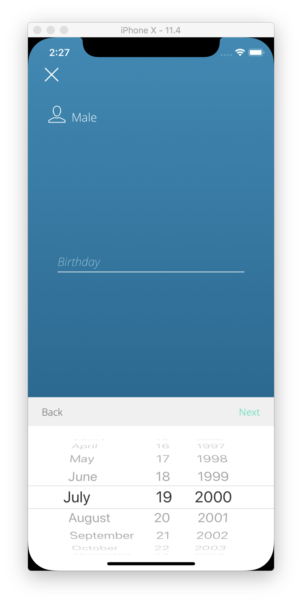
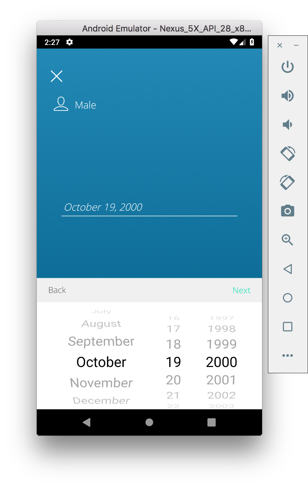

# react-native-wheel-datepicker

A iOS style picker and datepicker components for ReactNative.

- Fork by @lesliesam: [react-native-wheel-datepicker](https://github.com/pinguinjkeke/react-native-wheel-datepicker).
- Original repository by @lesliesam: [react-native-wheel-picker](https://github.com/lesliesam/react-native-wheel-picker).
- Fork by @wusuopu who added the real cross platform behavior and datepicker [react-native-wheel-picker](https://github.com/wusuopu/react-native-wheel-picker).

## Introduction
Cross platform Picker component for React-native designed to mimic iOS.

The android component is based on [wheel-picker](https://github.com/AigeStudio/WheelPicker) v1.0.3 BETA which runs super fast and smoothly. It also supports curved effect which make it exactly the same looking and feel as the iOS picker.





## How to use

Run command

```
yarn add react-native-wheel-datepicker
```

Configuration:

```
react-native link react-native-wheel-datepicker
```

## Ingegration with CustomDatePickerIOS

By default, package provides default DatePickerIOS on the iOS side to simplify usage on both platforms.

You can install [react-native-custom-datepicker-ios](https://github.com/pinguinjkeke/react-native-custom-datepicker-ios) package
if you need textColor functionality on IOS platform.

Just install:
```
yarn add https://github.com/Reliantid/react-native-wheel-datepicker
```
link dependencies:
```
react-native link react-native-custom-datepicker-ios
```
And register CustomDatePickerIOS inside react-native-wheel-datepicker package.
```js
import { registerCustomDatePickerIOS } from 'react-native-wheel-datepicker';
import CustomDatePickerIOS from 'react-native-custom-datepicker-ios';

registerCustomDatePickerIOS(CustomDatePickerIOS);
```
Then you can use textColored components for both platforms inside render function!
```jsx
import { DatePicker } from 'react-native-wheel-datepicker';

// ...
render() {
  return (
    <DatePicker
      mode="date"
      textColor="green"
    />
  )
}
```

## Example code

```jsx
import { Picker, DatePicker } from 'react-native-wheel-datepicker';

// use DatePicker
<DatePicker
  mode="date"
/>

// use Picker
<Picker
  style={{ flex: 1 }}
  selectedValue={1}
  pickerData={[1, 2, 3, 4, 5, 6]}
  onValueChange={value => this.setState({ value })}
/>
```
